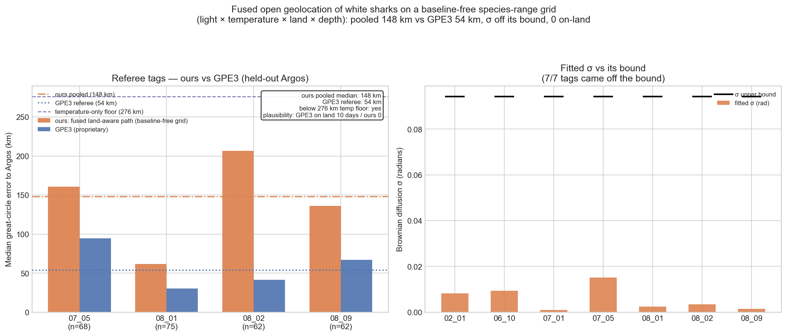
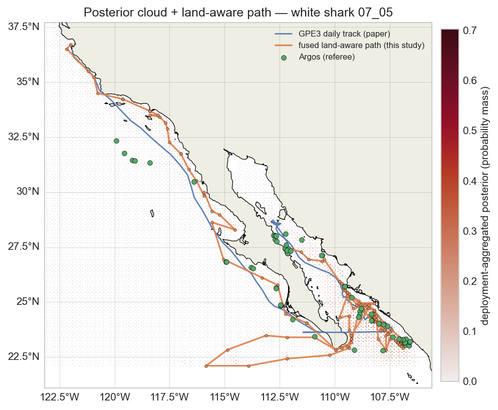

# white-shark-geolocation-light

> **A biologging database of juvenile white sharks from the northeast Pacific** — replication study.
>
> Reference paper: [10.1038/s41597-022-01235-3](https://doi.org/10.1038/s41597-022-01235-3)

This repository is a self-contained replication of the headline claim from the reference paper above. It produces:

- A reproducible computational pipeline (Snakefile + notebooks).
- A FORRT-tagged nanopublication chain on the [Science Live platform](https://platform.sciencelive4all.org), documenting the claim, the replication design, and the outcome with full provenance.
- A Zenodo-archived release (source + container image) with a citable DOI.

## Headline result

An open, fully-reproducible light + sea-surface-temperature + bathymetry hidden Markov geolocation model reproduces the daily tracks of four co-deployed (PAT + SPOT) juvenile white sharks at a **pooled median error of 148 km** to the held-out SPOT Argos referee, versus **54 km** for the proprietary GPE3 product. The open method never places the animal on land (GPE3 does, on 10 of the four tags' days), respects bathymetry, and confirms the falsifiable prediction that the fitted movement σ comes off its optimisation bound. Outcome: **partially supported** (the open method is reproducible and physically consistent, but less accurate than the proprietary product).



Example track (shark 07_05) — the posterior probability cloud, our land-aware track (orange), the GPE3 baseline (blue), and the held-out Argos fixes (green):



> The figures above are committed to the repository; CI builds this book from them rather than re-executing the multi-hour geolocation pipeline. To regenerate them, run `pixi run snakemake --cores 1` on dedicated compute (it downloads ~2.5 GB of GLORYS ocean fields and fits a HMM per tag).

## Quick start

```bash
git clone https://github.com/annefou/white-shark-geolocation-light.git
cd white-shark-geolocation-light
pixi install
pixi run snakemake --cores 1
```

Or with Docker:

```bash
docker run --rm ghcr.io/annefou/white-shark-geolocation-light:latest
```

## Structure

- `paper/` — the source paper PDF (drop yours in there).
- `notebooks/` — jupytext `.py` notebooks that drive the pipeline.
- `data/` — downloaded by `notebooks/01_data_download.py`, never committed.
- `nanopubs/` — drafts of the FORRT chain field-by-field, plus the published-URI registry.
- `docs/` — operating manuals (FORRT form fields, chain decision tree, claim-type vocabulary).
- `figures/` — curated figures used in the Jupyter Book.

## Nanopublication chain

The published chain is listed in [`nanopubs/PUBLISHED.md`](nanopubs/PUBLISHED.md). Each step links to its viewer URL on the Science Live platform.

## Citation

If you use this work, please cite both:

- This software: [`CITATION.cff`](CITATION.cff) → DOI [{{ZENODO_DOI}}]({{ZENODO_DOI}}).
- The original paper: [10.1038/s41597-022-01235-3](https://doi.org/10.1038/s41597-022-01235-3).
